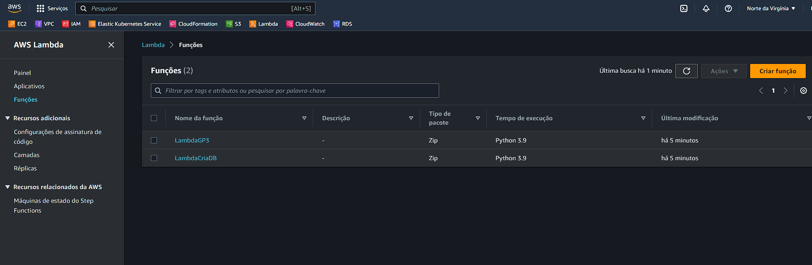

# bootcamp-provisionamento

| Grupo 3 |Git|
| ----------- | ----------- |
| Iago | https://github.com/iagofrei |
| Leandro  |  |
| Raphael Pivato | https://github.com/raphaeljpivato |
| Rodrigo Brito | https://github.com/rodrigobfigueredo |
| Vinicius Soares | https://github.com/vinusheer |
| Rafael Rodrigues | https://github.com/rafaelrassis |

-----------------------------

# Passo a passo para executar o projeto

  1 - Fazer o git clone do projeto [Projeto D-Tech Grupo 3](https://github.com/iagofrei/bootcamp-provisionamento)

  2 - Após feito o git clone, executar o terminal WSL na pasta bootcamp-provisionamento

  3 - Aplicar o comando ` chmod +x deploy-dtech-gp3.sh ` para dar as permissões de execução para o arquivo deploy-dtech-gp3.sh

  4 - Após isso deve ser aplicado o comando ` ./deploy-dtech-gp3.sh ` para que o script shell aplique os comandos para rodar o projeto

  5 - Aguardar o apply ser finalizado com sucesso
      
  

  6 - Após finalizado o apply, os proximos passos serão na console aws (lembrando que tem que ser acessado na região us-east-1)

  7 - Entrar no painel de lambdas, vamos encontrar 2 lambdas criadas:

  

  8 - Vamos acessas a LambdaCriaDB, pós ela ira configurar as tabelas que vamos usar no nosso banco da dados, dentro da lambda, vamos entrar na aba testar (item 1) e após isso vamos clicar no botão Testar (item 2)

  

  9 - Após clicar em testar a lambda ira executar os scripts para a criação das tabelas no banco de dados, sera exibida uma aba de resultados da execução, que ela pode ser expandida para ver os logs da lambda como nas imagens abaixo:

  
  

  10 - A lambda de criação do DB ja foi utilizada, agora iremos utilizar a LambdaGP3, dentro dela podemos ver que ela possui um gatilho com o S3:

  

  11 - Para testar a LamgdaGP3 vamos precisar entrar no S3 e acessar o bucket de-op-009-bucket-dtech-gp3

  

  12 - Dentro do bucket vamos fazer o Upload de um arquivo, no exemplo eu fiz o upload do arquivo "arquivo_teste.txt" que esta no projeto:

  

  13 - Após realizar o upload do arquivo, vamos entrar no CloudWatch para ver os logas da LambdaGP3

  

  14 - Dentro do Grupo de logs vamos entrar no grupo /aws/lambda/LambdaGP3, e depois no fluxo de logs que foi criado:

  

  15 - Podemos observar que as 2 queries que a lambda faz foram ralizadas com sucesso:

  

  16 - Podemos expandir as logs para ver as informações completas:

  

  17 - Pronto agora todos os passos do projeto foram finalizados

  18 - Após isso devemos rodar o comando de destroy para derrubar tudo o que foi criado, deve ser aplicado o comando ` terraform destroy -auto-approve ` no terminal WSL

  19 - Agora é só aguardar o destroy ser finalizado com sucesso

  
